# Bamazon-App

## Overview
Bamazon is a Node.js Command-Line Interface (CLI) application that consists of multiple user interface with varying features. You can shop and 'purchase' as a Customer, view product sales, control inventory levels, and add new products as a Manager, or develop new departments and review P&L tables as a Supervisor. 

#### Customer Level

As a Customer at Bamazon, the application will begin by displaying a prompt that allows the Customer to shop by Department or all available products through the 'Not Sure' option. The items can then be 'purchased' from the Bamazon store by selecting the products ID. Once an item has been chosen, the application will check available stock against the desired purchase quantity. If the stock is available, the purchase will be processed, the inventory will be reduced by the quantity purchsed, and the sale will be added to the product sales. If the stock is not available to fill the order, the Customer will be given a prompt to choose another item or reduce desired quantity. 

*Initial Prompt*
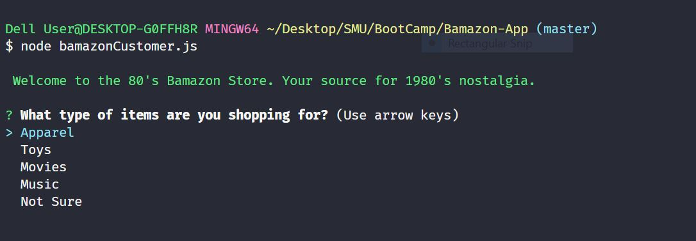

*Apparel Department Selected and Excessive Quantity Selected*
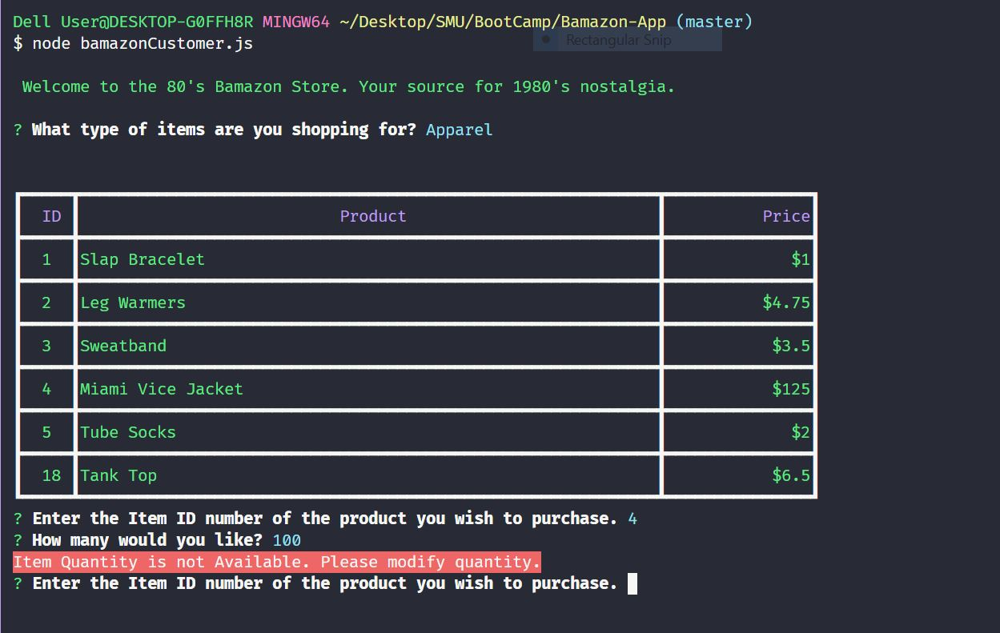

*Apparel Department Selected and Purchase Successful*
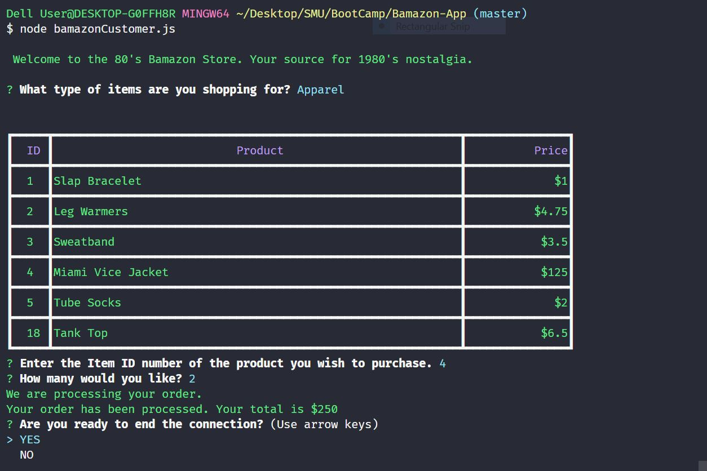

*mySQL Database Pre-Purchase*
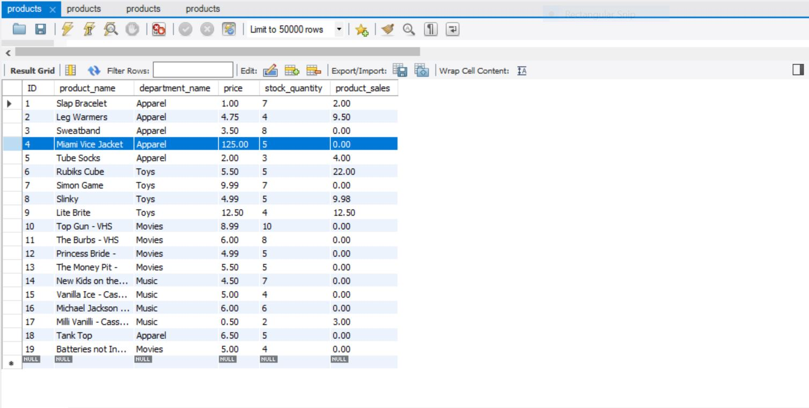

*mySQL Database Post-Purchase showing updated stock quantity on purchased Item*
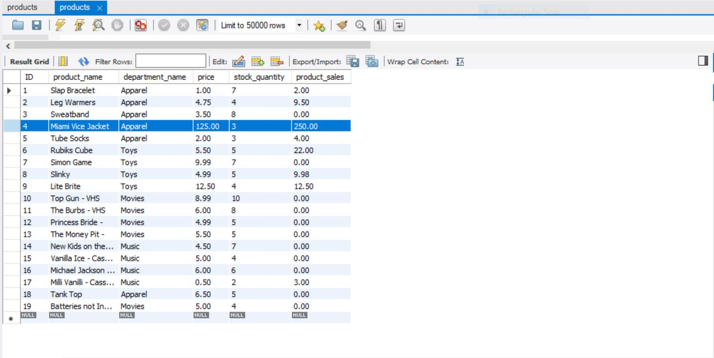

#### Manager Level
As a Manager for Bamazon, the application will begin by displaying a list of options: 

*Initial Prompt*
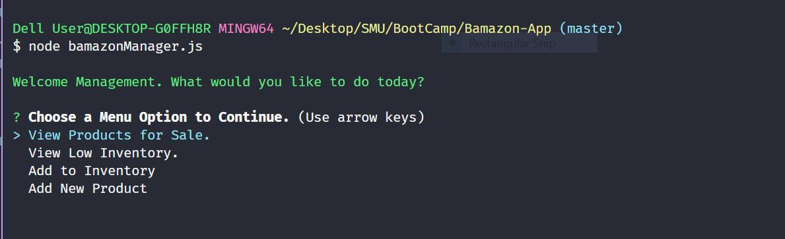

* View Products for Sale - will list all available items for sale with the following information: item IDs, names, prices, and quantities.

*View Products*
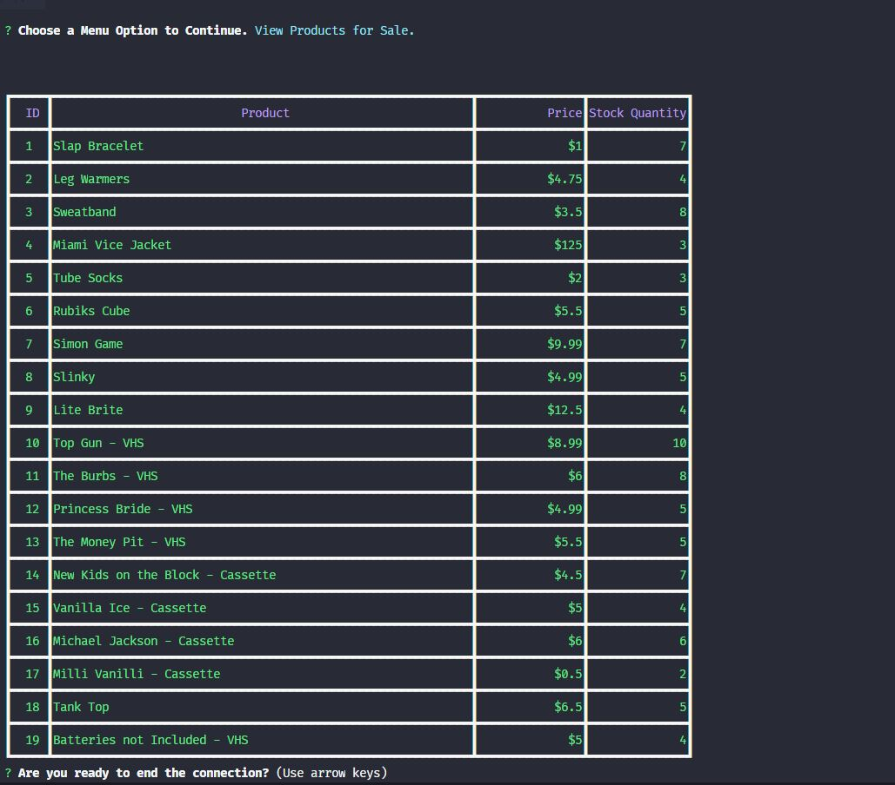

* View Low Inventory - will list all items with an inventory count lower than five.

*Low Inventory*
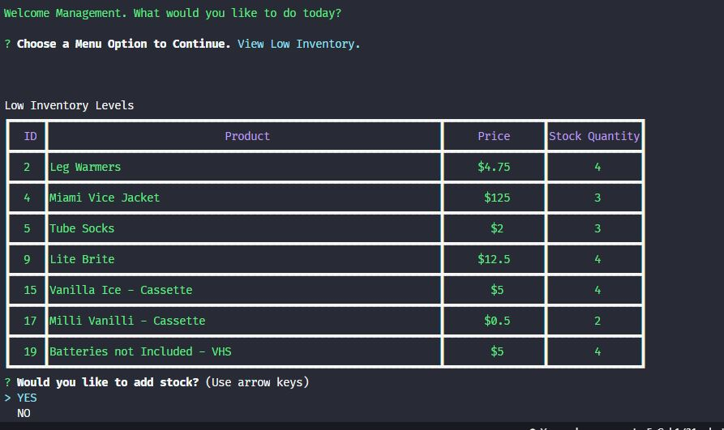

* Add to Inventory - will display a prompt that will allow stock to be replenished. 

*Add Inventory*
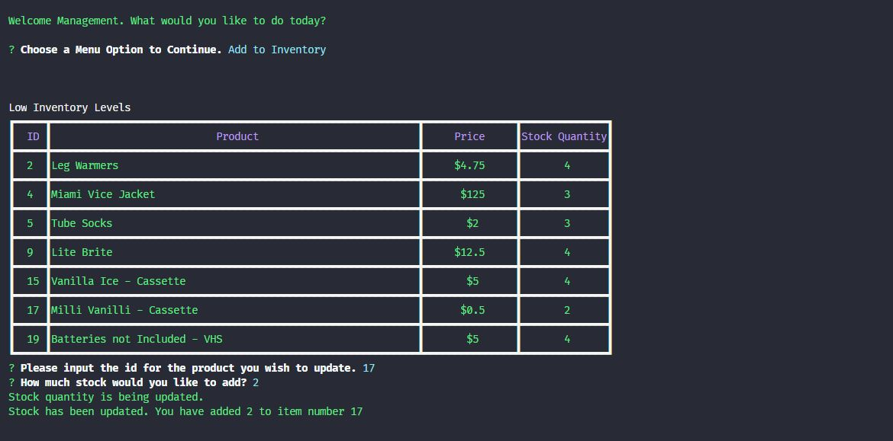

*Inventory Added*
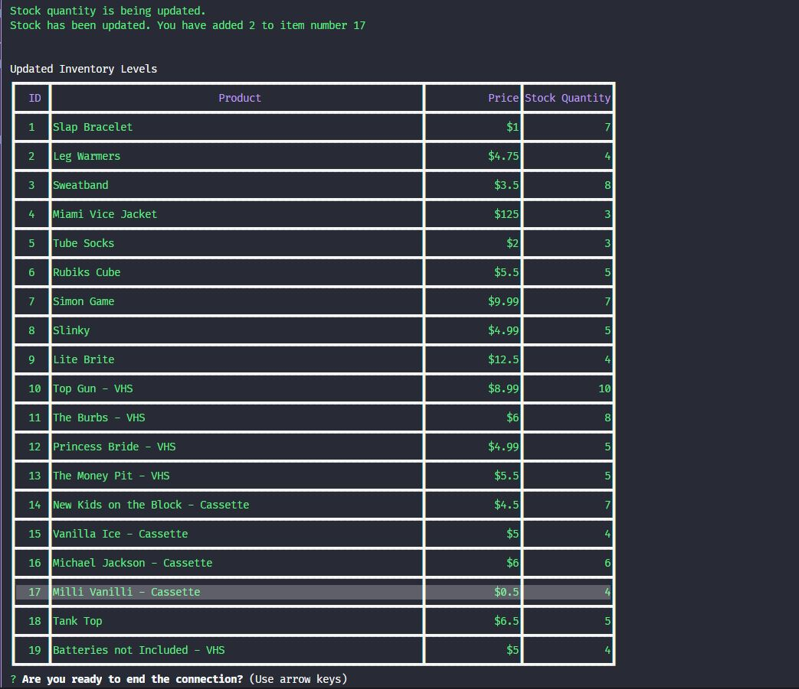

The inventory database will be updated with any inventory added by the Manager.

*mySQL Database before added Inventory*
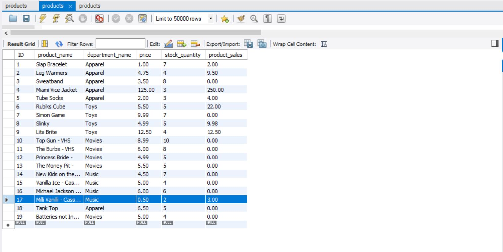

*mySQL Database after added Inventory*
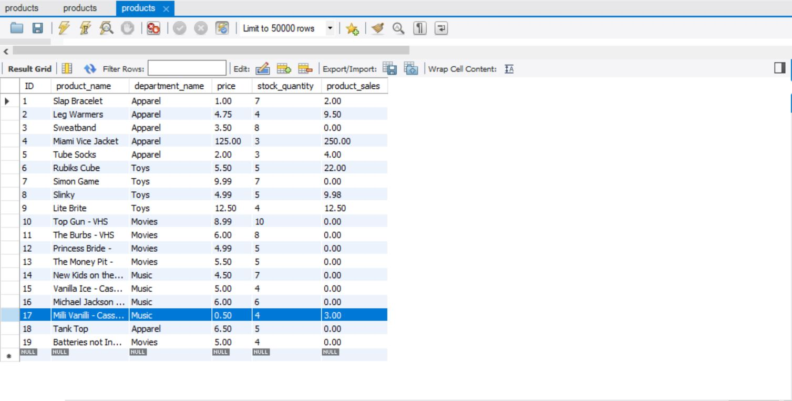

* Add New Product - will allow a completely new product to be added to the store.

*New Product*
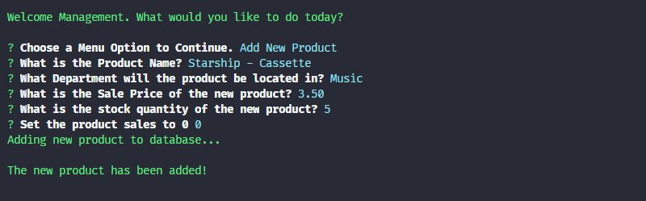

*New Product Added*
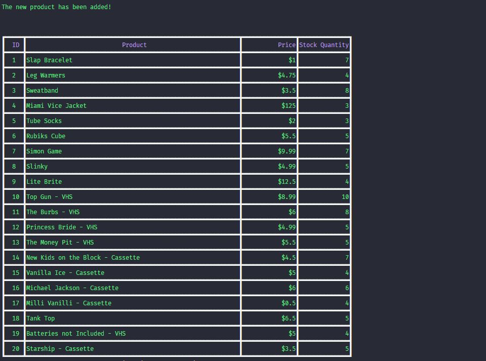

 The inventory database will be updated with any new products added by the Manager.
 
 *mySQL Database Pre-Product Added*
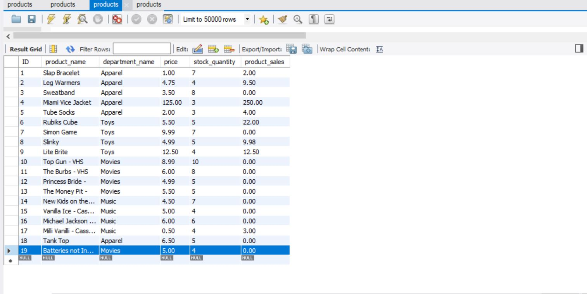

*mySQL Database Post-Product Added *
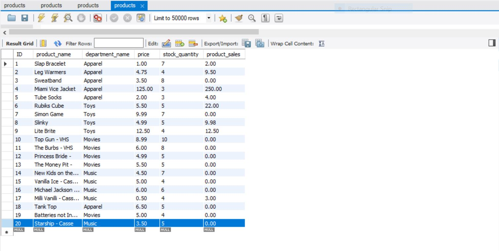
 

#### Supervisor Level - UNDER CONSTRUCTION
As a Supervisor at Bamazon, the application will begin by displaying a list of options:

*Supervisor Menu*
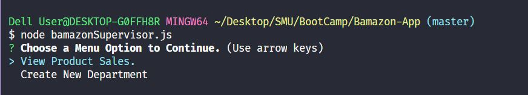

* View Product Sales by Department - displays a summarized table with department_id, department_name, over_head_costs, product_sales, and total_profit.

* Create New Department - will allow entirely new Departments to be created for Bamazon. 

### INSTALL
1. Clone the Repository to your machine via the command line. 
2. Make sure mySQL Workbench is installed on your machine. If not, vist [mySQL](https://dev.mysql.com/downloads/windows/installer/8.0.html)
3. Create the database in mySQL with the schema file provided.
4. Use the ``` npm install ``` command in the command line to install the dependencies from the package.json file.

### USE
1. Using the Command Line, navigate to the root file and input:
* ``` node bamazonCustomer.js ``` - This will run the Customer Side.
* ``` node bamazonManger.js ``` - This will run the Manager Side.
* ``` node bamazonSupervisor.js ``` - This will run the Supervisor Side.
2. Follow the Prompts on the screen.

### Crafted With
* mySQL
* Node.JS
* JavaScript
* Visual Studio
* GitBash

### NPM'S
* [terminal-table] (https://www.npmjs.com/package/terminal-table)
* [inquirer] (https://www.npmjs.com/package/inquirer)
* [colors.js] (https://www.npmjs.com/package/colors)
* [mysql] (https://www.npmjs.com/package/mysql)

### Authors
Dustin McGilvray

